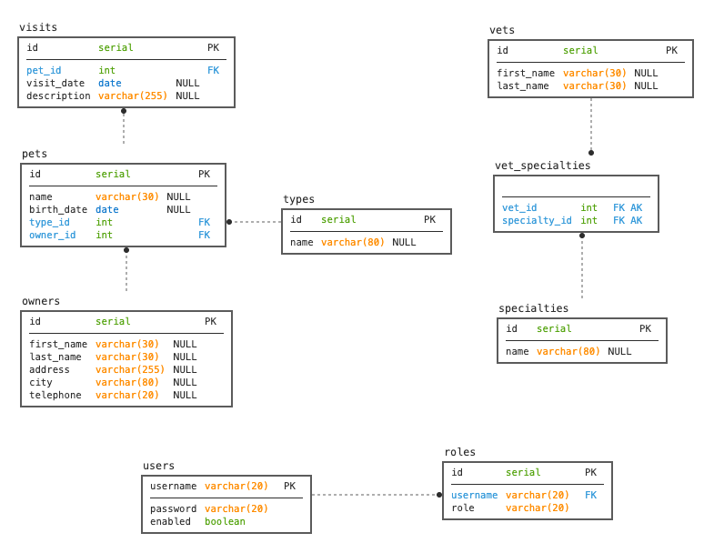

[](https://quarkus.io/)

# Quarkus PetClinic Sample Application

This backend version of the Spring Petclinic application only provides a REST API. **There is no UI**.
The [spring-petclinic-angular project](https://github.com/spring-petclinic/spring-petclinic-angular) is a Angular front-end application which consumes the REST API.

A modified version (specific to this project) of the [spring-petclinic-angular project](https://github.com/spring-petclinic/spring-petclinic-angular) can be found [HERE](https://github.com/mpbauer/spring-petclinic-angular)

## Understanding the Spring Petclinic application with a few diagrams

[See the presentation of the Spring Petclinic Framework version](http://slideshare.net/AntoineRey/spring-framework-petclinic-sample-application)

A local copy of the presentation can be found [here](docs/misc/springframeworkpetclinic-presentation.pdf)

### Petclinic ER Model




## Running the petclinic application locally

### With Maven in `dev` mode

You can run your application in dev mode that enables live coding using:
```shell script
./mvnw quarkus:dev
```

## Packaging and running the application with JVM

The application can be packaged using:
```shell script
./mvnw package
```
It produces the `quarkus-petclinic-rest-1.0.0-SNAPSHOT-runner.jar` file in the `/target` directory.
Be aware that it’s not an _über-jar_ as the dependencies are copied into the `target/lib` directory.

:bulb: If you want to build an _über-jar_, execute the following command:
```shell script
./mvnw package -Dquarkus.package.type=uber-jar
```

### With Docker

Before building the container image run:
```shell script
./mvnw package
```

Then, build the image with:
```shell script
docker build -f src/main/docker/Dockerfile.jvm -t quarkus/quarkus-petclinic-rest-jvm .
```

Then run the container using:
```shell script
docker run -i --rm -p 8080:8080 quarkus/quarkus-petclinic-rest-jvm
```

You can then access petclinic here: http://localhost:8080/petclinic/

The application is now runnable using `java -jar target/quarkus-petclinic-rest-1.0.0-SNAPSHOT-runner.jar`.

## Creating a native executable

Creating a native executable requires [GraalVM](https://www.graalvm.org/). Make sure to install and configure a compatible version of GraalVM before you try to build a native image.
For more information on how to build native executables check out [this](https://quarkus.io/guides/building-native-image#:~:text=While%20Oracle%20GraalVM%20is%20available,install%20the%20Java%2011%20version.) link.

### With Maven

You can create a native executable using: 
```shell script
./mvnw package -Pnative
```

You can then execute your native executable with:
```shell script
./target/quarkus-petclinic-rest-1.0.0-SNAPSHOT-runner
```

**Optional:** If you don't have [GraalVM](https://www.graalvm.org/) installed, you can run the native executable build in a container using: 

```shell script
./mvnw package -Pnative -Dquarkus.native.container-build=true
```

:exclamation: Building native images with `-Dquarkus.native.container-build=true` requires a running Docker installation. Keep in mind that the `Docker` build
will be performed in a Linux container and will not be executable on a MacOS or Windows machine. 

### With Docker

Before building the container image run:
```shell script
./mvnw package -Pnative
```

Then, build the image with:
```shell script
docker build -f src/main/docker/Dockerfile.native -t quarkus/quarkus-petclinic-rest-native .
```

Then run the container using:
```shell script
docker run -i --rm -p 8080:8080 quarkus/quarkus-petclinic-rest-native
```

You can then access petclinic here: http://localhost:8080/petclinic/

## OpenAPI REST Documentation

The following URLs can be used to access a documentation about the [quarkus-petclinic-rest](https://github.com/mpbauer/quarkus-petclinic-rest) application:

**OpenAPI UI**

Provides a graphical user interface with all existing REST endpoints:
```
http://localhost:8080/petclinic/q/swagger-ui/
```

**Open API  Schema Document**

Provides an endpoint to download the Open API REST documentation:
```
http://localhost:8080/petclinic/q/openapi
```

## Health Checks

The `smallrye-health` dependency provides health checks out of the box. The following endpoints are provided:

 - `/q/health/live` - The application is up and running (liveness probe)
 - `/q/health/ready` - The application is ready to serve requests (readiness probe)
 - `/q/health` - Accumulating all health check procedures in the application
 - `q/health-ui` - Provides a graphical user interface for health information

Example:
```
http://localhost:8080/petclinic/q/health
```

## Metrics

The `smallrye-metrics` dependency provides metrics which can be accessed through the `/q/metrics` endpoint.

Example:
```
http://localhost:8080/petclinic/q/metrics
```

## Database configuration

The database support for this version of the [spring-petlinic-rest](https://github.com/spring-petclinic/spring-petclinic-rest) project was significantly reduced. As of now this project only supports [PostgreSQL](https://www.postgresql.org/) and [H2](https://www.h2database.com/html/main.html).

In its default configuration a `PostgreSQL` database is required to run the application.
For the execution of tests an embedded `H2` is started.


For local development you may want to start a `PostgreSQL` database with `Docker`:

````
docker run --name petclinic -p 5432:5432 -e POSTGRES_PASSWORD=pass -d postgres
````

## Security configuration

In its default configuration, Petclinic doesn't have authentication and authorization enabled

> :construction: This section is currently under heavy construction. At the moment JWT based authentication is not implemented yet

### Enable Authentication

In order to use the JWT based authentication functionality, you can turn it on by setting the following property 
in the `application.properties` file:
```
petclinic.security.enable=false
```

### Authorization
This will secure all APIs and in order to access them, basic authentication is required.
Apart from authentication, APIs also require authorization. This is done via roles that a user can have.
The existing roles are listed below with the corresponding permissions:


Role         | Controller
----------   | ----------------
OWNER_ADMIN  | OwnerController<br/>PetController<br/>PetTypeController (`getAllPetTypes()` & `getPetType()`)
VET_ADMIN    | PetTypeController<br/>SpecialityController</br>VetController
ADMIN        | UserController

# GitHub Actions CI/CD configuration

This section explains the necessary setup details to build and deploy the `quarkus-petclinic-rest` application to [Google Cloud Platform (GCP)](https://cloud.google.com/) and [Amazon Web Services (AWS)](https://aws.amazon.com/).

## Google Cloud Platform (GCP)

GitHub Actions is building the container images with [Google Cloud Build](https://cloud.google.com/build) and stores the 
resulting container image in [Google Container Registry](https://cloud.google.com/container-registry). Afterwards the image
is going to be deployed to [Google Cloud Run](https://cloud.google.com/run)

### Prerequisites

Before you start you should have already set up a [GCP account](https://cloud.google.com/gcp) with a [billing account](https://cloud.google.com/billing/docs/how-to/manage-billing-account) as well as a project. 
There are several ways to set up a service account with GCP. You can either use the Google Cloud SDK or the Management 
Console in your browser to create and configure service accounts.

### Create a Service Account with `gcloud`

1) Export these environment variables so that you can copy and paste the following commands:
```
export PROJECT_ID=<YOUR PROJECT ID>
export SERVICE_ACCOUNT_NAME=<ENTER A NAME FOR YOUR SERVICE ACCOUNT>
```

2) Log in with your Google account:
```
gcloud auth login
```

3) Select the project configured via `$PROJECT_ID`:
```
gcloud config set project $PROJECT_ID
```

4) Enable the necessary services:
```
gcloud services enable cloudbuild.googleapis.com run.googleapis.com containerregistry.googleapis.com
```

5) Create a service account:
```
gcloud iam service-accounts create $SERVICE_ACCOUNT_NAME \
  --description="Cloud Run deploy account" \
  --display-name="Cloud-Run-Deploy"
```

6) Give the service account Cloud Run Admin, Storage Admin, and Service Account User roles. You can’t set all of them at once, so you have to run separate commands:
```
gcloud projects add-iam-policy-binding $PROJECT_ID \
  --member=serviceAccount:$SERVICE_ACCOUNT_NAME@$PROJECT_ID.iam.gserviceaccount.com \
  --role=roles/run.admin

gcloud projects add-iam-policy-binding $PROJECT_ID \
  --member=serviceAccount:$SERVICE_ACCOUNT_NAME@$PROJECT_ID.iam.gserviceaccount.com \
  --role=roles/storage.admin

gcloud projects add-iam-policy-binding $PROJECT_ID \
  --member=serviceAccount:$SERVICE_ACCOUNT_NAME@$PROJECT_ID.iam.gserviceaccount.com \
  --role=roles/iam.serviceAccountUser
```

7) Generate a key.json file with your credentials, so your GitHub workflow can authenticate with Google Cloud. After issuing
the following command you can find the generated key in your current folder.
```
gcloud iam service-accounts keys create key.json \
    --iam-account $SERVICE_ACCOUNT_NAME@$PROJECT_ID.iam.gserviceaccount.com
```

The following tutorial explains this in more detail: [link](https://cloud.google.com/community/tutorials/cicd-cloud-run-github-actions)

### Create a Service Account with [GCP Management Console](https://console.cloud.google.com/)

1) Open the [Google Cloud Management Console](https://console.cloud.google.com) in your browser

2) Select your project with the dropdown on the top navigation bar
   
    [](docs/screenshots/setup-gcp-service-account/setup_gcp_service_account_00.png)

3) Go to [IAM & Admin](https://console.cloud.google.com/iam-admin/) > [Service Accounts](https://console.cloud.google.com/iam-admin/serviceaccounts) and click `ADD`to create a new service account

4) Enter a name and a description (optional) for your new service account and click `CREATE`
    [](docs/screenshots/setup-gcp-service-account/setup_gcp_service_account_01.png)

5) Add the following roles to your service account and click `DONE`. The third step is not necessary and can be skipped.
    - `Cloud Run Admin`
    - `Storage Admin`
    - `Service Account User`

   [](docs/screenshots/setup-gcp-service-account/setup_gcp_service_account_02.png)

6) Now click on your newly created service account and click `ADD KEY` on the service account details page. 
   This will create new credentials which will be later used to authenticate your service account. Select `JSON`and 
   click `CREATE` to generate and download your service account credentials.

   [](docs/screenshots/setup-gcp-service-account/setup_gcp_service_account_03.png)

7) Your service account credentials have been generated and downloaded on your machine. Make sure to keep them safe!

   [](docs/screenshots/setup-gcp-service-account/setup_gcp_service_account_04.png)


### GitHub configuration

In GitHub, you need to set up the following secrets via your repositories settings tab:

- `GCP_PROJECT_ID` - The GCP project id which was defined in `$PROJECT_ID` during the service account creation step
- `GCP_APP_NAME` - The name of your app (used for container image tagging)
- `GCP_SERVICE_ACCOUNT_EMAIL` - The email from the previously created service account
- `GCP_SERVICE_ACCOUNT_CREDENTIALS` - The content from the `key.json` file that was previously created

In the end your secrets should look like this:

  [](docs/screenshots/setup-github-secrets/setup_github_gcp_secrets_00.png)


## Amazon Web Services (AWS)

> :construction: This section is currently under heavy construction. Please check again later!
